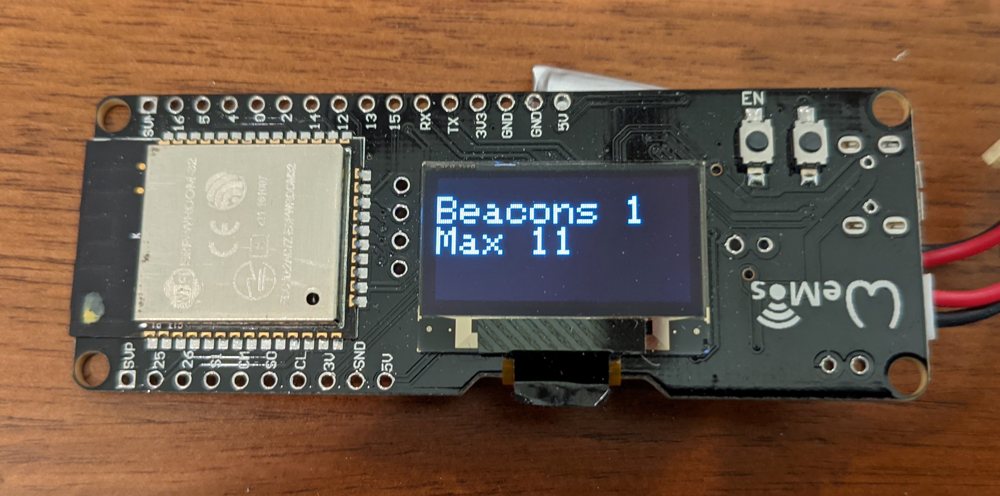

# ESP32 Sketch to show COVID beacon count

Super simple sketch that shows the current count of COVID exposure tracing beacons currently being detected, as well as the maximum detected in any 30 second interval.

Bluetooth protocal information can be found [here](https://covid19.apple.com/contacttracing)

Configured to run on the [MakerFocus ESP32 OLED board](https://www.amazon.com/gp/product/B076CB6VM2/)

